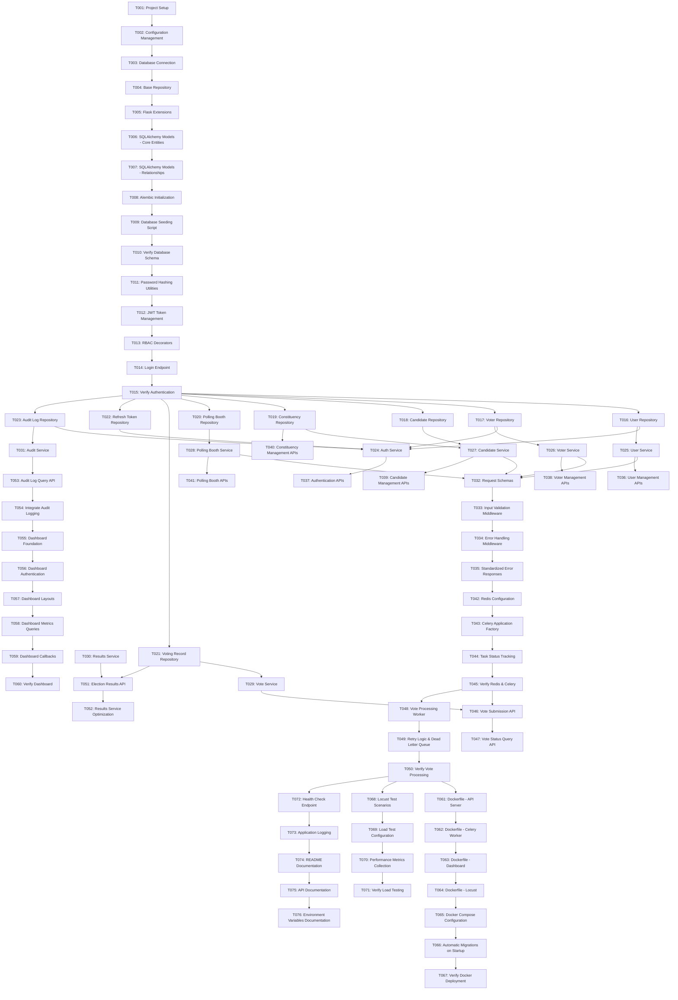

# Implementation Plan: Election Operations Platform

## Overview

This implementation plan breaks down the Election Operations Platform into discrete, testable coding tasks organized into logical milestones. Each task specifies what to build, which files to create or modify, dependencies, and the expected runnable state after completion.

The platform is built as a **modular monolith** using Python/Flask with asynchronous vote processing via Celery/Redis, PostgreSQL for data persistence, and Plotly Dash for operational monitoring. Tasks progress from foundational infrastructure through core business logic to deployment and testing.

## Tasks

- [ ] T001 - Project Setup and Folder Structure
- [ ] T002 - Configuration Management
- [ ] T003 - Database Connection and Health Checks
- [ ] T004 - Base Repository Pattern Implementation
- [ ] T005 - Flask Extensions Registration
- [ ] T006 - SQLAlchemy Models - Core Entities
- [ ] T007 - SQLAlchemy Models - Relationships
- [ ] T008 - Alembic Initialization
- [ ] T009 - Database Seeding Script
- [ ] T010 - Verify Database Schema
- [ ] T011 - Password Hashing Utilities
- [ ] T012 - JWT Token Management
- [ ] T013 - RBAC Decorators
- [ ] T014 - Login Endpoint
- [ ] T015 - Verify Authentication
- [ ] T016 - User Repository
- [ ] T017 - Voter Repository
- [ ] T018 - Candidate Repository
- [ ] T019 - Constituency Repository
- [ ] T020 - Polling Booth Repository
- [ ] T021 - Voting Record Repository
- [ ] T022 - Refresh Token Repository
- [ ] T023 - Audit Log Repository
- [ ] T024 - Auth Service
- [ ] T025 - User Service
- [ ] T026 - Voter Service
- [ ] T027 - Candidate Service
- [ ] T028 - Polling Booth Service
- [ ] T029 - Vote Service
- [ ] T030 - Results Service
- [ ] T031 - Audit Service
- [ ] T032 - Request Schemas
- [ ] T033 - Input Validation Middleware
- [ ] T034 - Error Handling Middleware
- [ ] T035 - Standardized Error Responses
- [ ] T036 - User Management APIs
- [ ] T037 - Authentication APIs
- [ ] T038 - Voter Management APIs
- [ ] T039 - Candidate Management APIs
- [ ] T040 - Constituency Management APIs
- [ ] T041 - Polling Booth APIs
- [ ] T042 - Redis Configuration
- [ ] T043 - Celery Application Factory
- [ ] T044 - Task Status Tracking
- [ ] T045 - Verify Redis & Celery
- [ ] T046 - Vote Submission API
- [ ] T047 - Vote Status Query API
- [ ] T048 - Vote Processing Worker
- [ ] T049 - Retry Logic & Dead Letter Queue
- [ ] T050 - Verify Vote Processing
- [ ] T051 - Election Results API
- [ ] T052 - Results Service Optimization
- [ ] T053 - Audit Log Query API
- [ ] T054 - Integrate Audit Logging
- [ ] T055 - Dashboard Foundation
- [ ] T056 - Dashboard Authentication
- [ ] T057 - Dashboard Layouts
- [ ] T058 - Dashboard Metrics Queries
- [ ] T059 - Dashboard Callbacks
- [ ] T060 - Verify Dashboard
- [ ] T061 - Dockerfile - API Server
- [ ] T062 - Dockerfile - Celery Worker
- [ ] T063 - Dockerfile - Dashboard
- [ ] T064 - Dockerfile - Locust
- [ ] T065 - Docker Compose Configuration
- [ ] T066 - Automatic Migrations on Startup
- [ ] T067 - Verify Docker Deployment
- [ ] T068 - Locust Test Scenarios
- [ ] T069 - Load Test Configuration
- [ ] T070 - Performance Metrics Collection
- [ ] T071 - Verify Load Testing
- [ ] T072 - Health Check Endpoint
- [ ] T073 - Application Logging
- [ ] T074 - README Documentation
- [ ] T075 - API Documentation
- [ ] T076 - Environment Variables Documentation

## Notes

- **Parallel Execution**: Tasks within the same wave in the dependency graph can be executed in parallel to accelerate development
- **Sequential Dependencies**: Respect wave ordering - all tasks in wave N must complete before starting wave N+1
- **Testing Strategy**: Verification tasks (T010, T015, T045, T050, T060, T067, T071) serve as checkpoints to validate system functionality before proceeding
- **Infrastructure First**: Foundation and schema tasks (waves 0-2) must complete before business logic implementation
- **Incremental Integration**: Service and repository layers are built incrementally with continuous integration to catch issues early
- **Documentation Last**: Documentation tasks (T074-T076) are positioned at the end but should be updated incrementally as features are completed
- **Docker Deployment**: Container and deployment tasks (T061-T067) bundle the complete application for production-ready deployment
- **Load Testing**: Performance validation (T068-T071) ensures the system meets scalability requirements under concurrent load

## Task Dependency Graph



### Execution Waves

```json
{
  "waves": [
    { "id": 0, "tasks": ["T001"] },
    { "id": 1, "tasks": ["T002"] },
    { "id": 2, "tasks": ["T003"] },
    { "id": 3, "tasks": ["T004"] },
    { "id": 4, "tasks": ["T005"] },
    { "id": 5, "tasks": ["T006"] },
    { "id": 6, "tasks": ["T007"] },
    { "id": 7, "tasks": ["T008"] },
    { "id": 8, "tasks": ["T009"] },
    { "id": 9, "tasks": ["T010"] },
    { "id": 10, "tasks": ["T011"] },
    { "id": 11, "tasks": ["T012"] },
    { "id": 12, "tasks": ["T013"] },
    { "id": 13, "tasks": ["T014"] },
    { "id": 14, "tasks": ["T015"] },
    { "id": 15, "tasks": ["T016", "T017", "T018", "T019", "T020", "T021", "T022", "T023"] },
    { "id": 16, "tasks": ["T024", "T025", "T026", "T027", "T028", "T029", "T030", "T031"] },
    { "id": 17, "tasks": ["T032"] },
    { "id": 18, "tasks": ["T033"] },
    { "id": 19, "tasks": ["T034"] },
    { "id": 20, "tasks": ["T035"] },
    { "id": 21, "tasks": ["T036", "T037", "T038", "T039", "T040", "T041"] },
    { "id": 22, "tasks": ["T042"] },
    { "id": 23, "tasks": ["T043"] },
    { "id": 24, "tasks": ["T044"] },
    { "id": 25, "tasks": ["T045"] },
    { "id": 26, "tasks": ["T046", "T048"] },
    { "id": 27, "tasks": ["T047", "T049"] },
    { "id": 28, "tasks": ["T050"] },
    { "id": 29, "tasks": ["T051"] },
    { "id": 30, "tasks": ["T052"] },
    { "id": 31, "tasks": ["T053"] },
    { "id": 32, "tasks": ["T054"] },
    { "id": 33, "tasks": ["T055"] },
    { "id": 34, "tasks": ["T056"] },
    { "id": 35, "tasks": ["T057"] },
    { "id": 36, "tasks": ["T058"] },
    { "id": 37, "tasks": ["T059"] },
    { "id": 38, "tasks": ["T060"] },
    { "id": 39, "tasks": ["T061", "T062", "T063", "T064", "T068", "T072"] },
    { "id": 40, "tasks": ["T065"] },
    { "id": 41, "tasks": ["T066"] },
    { "id": 42, "tasks": ["T067", "T069"] },
    { "id": 43, "tasks": ["T070", "T073"] },
    { "id": 44, "tasks": ["T071", "T074"] },
    { "id": 45, "tasks": ["T075"] },
    { "id": 46, "tasks": ["T076"] }
  ]
}
```

---

## Milestone 1: Foundation (T001-T005)

### Task T001: Project Setup and Folder Structure

**Objective**: Create the foundational directory structure and initialize the Python project with all necessary package files

**Dependencies**: None

**Files to Create**:
- `requirements.txt` — Python dependencies
- `app/__init__.py` — Application factory
- `app/api/__init__.py`
- `app/auth/__init__.py`
- `app/config/__init__.py`
- `app/models/__init__.py`
- `app/repositories/__init__.py`
- `app/services/__init__.py`
- `app/schemas/__init__.py`
- `app/utils/__init__.py`
- `app/extensions.py`
- `tasks/__init__.py`
- `dashboard/__init__.py`
- `tests/__init__.py`
- `tests/unit/__init__.py`
- `tests/integration/__init__.py`
- `tests/load/__init__.py`
- `scripts/__init__.py`
- `.gitignore`
- `README.md`

**Acceptance Criteria**:
1. All directories exist with proper `__init__.py` files
2. `requirements.txt` includes: Flask, SQLAlchemy, Alembic, Flask-JWT-Extended, Celery, Redis, python-dotenv, Plotly Dash, Locust, pytest, gunicorn, psycopg[binary], bcrypt, marshmallow
3. `.gitignore` excludes: `.env`, `__pycache__`, `*.pyc`, `venv/`, `.pytest_cache/`, `*.log`, `.vscode/`, `.idea/`, `migrations/versions/*.pyc`
4. `README.md` contains project title and brief description

**Expected Runnable State**: Python virtual environment can be created (`python -m venv venv`) and dependencies installed (`pip install -r requirements.txt`) without errors

_Requirements: Req 12 (Configuration Management), Req 13 (Containerized Deployment)_

---

### Task T002: Configuration Management

**Objective**: Implement environment-based configuration system using environment variables and .env file support

**Dependencies**: T001

**Files to Create**:
- `app/config/settings.py` — Configuration classes for different environments
- `.env.example` — Example environment variables template

**Acceptance Criteria**:
1. `settings.py` contains base `Config` class with common settings loaded from environment variables
2. `DevelopmentConfig`, `TestingConfig`, and `ProductionConfig` classes inherit from `Config` and override environment-specific settings
3. Configuration validates presence of required variables (DATABASE_URL, REDIS_URL, SECRET_KEY, JWT_SECRET_KEY) and exits with descriptive error if missing
4. `.env.example` documents all required and optional environment variables with example values and descriptions
5. Configuration supports selecting profile via `FLASK_ENV` variable (defaults to `development`)
6. No credentials or environment-specific values are hardcoded in source code

**Expected Runnable State**: Configuration can be imported and instantiated with valid environment variables set

_Requirements: Req 12 (Configuration Management)_

---

### Task T003: Database Connection and Health Checks

**Objective**: Establish PostgreSQL database connection with SQLAlchemy and implement basic health check

**Dependencies**: T002

**Files to Create**:
- `app/extensions.py` — Flask extension initialization (SQLAlchemy instance)
- `app/__init__.py` — Updated with application factory pattern

**Files to Modify**:
- `app/config/settings.py` — Add SQLAlchemy-specific configuration

**Acceptance Criteria**:
1. `app/extensions.py` initializes `SQLAlchemy` instance named `db`
2. Application factory in `app/__init__.py` creates Flask app, loads configuration, and initializes `db.init_app(app)`
3. Application factory registers a simple health check route `/health` that tests database connectivity with `db.session.execute('SELECT 1')`
4. Health check returns HTTP 200 with `{"status": "healthy"}` when database is reachable
5. Health check returns HTTP 503 with `{"status": "unhealthy", "error": "Database connection failed"}` when database is unreachable
6. Application uses connection pooling with default SQLAlchemy settings (5 connections per process)

**Expected Runnable State**: Flask application starts with `flask run` (requires PostgreSQL running locally or via Docker) and `/health` endpoint responds correctly

_Requirements: Req 14 (Database Schema Integrity)_

---

### Task T004: Base Repository Pattern Implementation

**Objective**: Create abstract base repository class with common CRUD operations to reduce code duplication across all repository classes

**Dependencies**: T003

**Files to Create**:
- `app/repositories/base.py` — BaseRepository abstract class

**Acceptance Criteria**:
1. `BaseRepository` class provides generic methods: `create(entity)`, `get_by_id(id)`, `get_all()`, `update(entity)`, `delete(id)`
2. All methods accept and return SQLAlchemy model instances
3. `get_by_id` returns `None` if entity not found (does not raise exception)
4. `delete` method performs soft delete by setting `deleted_at` timestamp if column exists, otherwise performs hard delete
5. Repository uses dependency injection pattern — accepts `db.session` in constructor
6. Unit tests verify each CRUD operation with mock session

**Expected Runnable State**: BaseRepository can be instantiated and unit tested without requiring actual database connection

_Requirements: Design decision (Repository Pattern for data access abstraction)_

---

### Task T005: Flask Extensions Registration

**Objective**: Register all Flask extensions (JWT, CORS, etc.) in a centralized location for consistent initialization across application factory

**Dependencies**: T004

**Files to Modify**:
- `app/extensions.py` — Add Flask-JWT-Extended initialization
- `app/__init__.py` — Register JWT manager with app

**Acceptance Criteria**:
1. `app/extensions.py` creates `jwt = JWTManager()` instance
2. Application factory calls `jwt.init_app(app)` after configuration loading
3. JWT configuration includes: `JWT_SECRET_KEY`, `JWT_ACCESS_TOKEN_EXPIRES=900` (15 minutes), `JWT_REFRESH_TOKEN_EXPIRES=604800` (7 days), `JWT_TOKEN_LOCATION=['headers']`
4. Application factory registers JWT error handlers for expired tokens, invalid tokens, and missing tokens
5. JWT error handlers return standardized JSON responses: `{"error": {"code": "TOKEN_EXPIRED", "message": "Access token has expired"}}`

**Expected Runnable State**: Flask application starts and JWT extension is available for use in authentication endpoints

_Requirements: Req 1 (User Authentication)_

---

## Milestone 2: Database Schema (T006-T010)

### Task T006: SQLAlchemy Models - Core Entities

**Objective**: Define SQLAlchemy ORM models for all core entities with appropriate column types, constraints, and validators

**Dependencies**: T005

**Files to Create**:
- `app/models/user.py` — User model
- `app/models/voter.py` — Voter model
- `app/models/candidate.py` — Candidate model
- `app/models/constituency.py` — Constituency model
- `app/models/polling_booth.py` — PollingBooth model
- `app/models/voting_record.py` — VotingRecord model
- `app/models/audit_log.py` — AuditLog model
